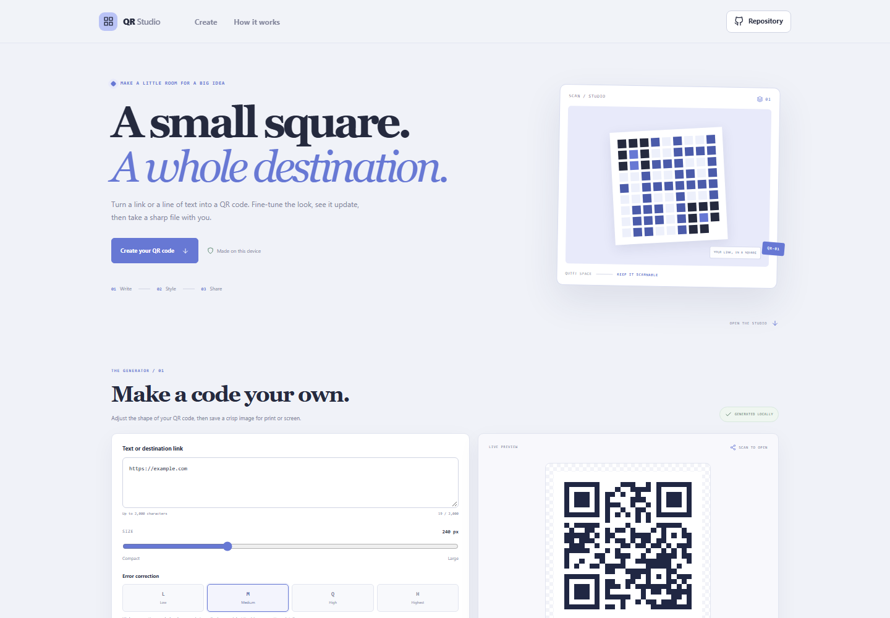



# QR Code Studio

Turn a link or text into a customizable QR code. Preview changes as you adjust size, error correction, and colors, then download a PNG or SVG file.

**Live app:** [https://a2rp.github.io/qr-code-studio/](https://a2rp.github.io/qr-code-studio/)

## Features

- Encodes links or text locally in the browser, with a 2,000-character input limit.
- Creates PNG and SVG output and offers a download for either format.
- Adjusts output width from 160 to 420 pixels.
- Sets error correction to L, M, Q, or H.
- Customizes foreground and background colors.
- Regenerates the preview as the content or settings change.
- Responsive controls, keyboard focus styles, and reduced-motion support.

## Use the studio

1. Enter the text or destination link to encode.
2. Adjust the size, error-correction level, or colors.
3. Scan the preview with a phone before sharing or printing.
4. Choose PNG for everyday use or SVG for sharp scaling, then download.

Higher error correction adds pattern detail and reduces the amount of content a code can hold. Dark foregrounds on light backgrounds are usually easiest to scan.

## Privacy and limits

Encoding and preview generation happen in your browser. This project does not upload or save the entered content. A downloaded QR image contains the text or link you chose to encode.

Scanner results vary with device cameras, print size, lighting, contrast, and damage. This tool cannot guarantee that every code will scan in every situation; test the exported file at its intended size.

## Development

Requirements: Node.js and npm.

    npm install
    npm run dev

Run checks and build:

    npm test
    npm run lint
    npm run build

Deploy to GitHub Pages:

    npm run deploy

## Future improvements

- Add downloadable print sheets for multiple QR codes.
- Add a small set of contrast-checked color presets.
- Support batch creation from a text file or CSV.

## Links

- Portfolio: [https://www.ashishranjan.net](https://www.ashishranjan.net)
- GitHub: [https://github.com/a2rp](https://github.com/a2rp)
- CodePen: [https://codepen.io/ash1198](https://codepen.io/ash1198)
- LinkedIn: [https://www.linkedin.com/in/aashishranjan](https://www.linkedin.com/in/aashishranjan)
- Facebook: [https://www.facebook.com/theash.ashish/](https://www.facebook.com/theash.ashish/)
- YouTube: [https://www.youtube.com/@ashishranjan-ashz?sub_confirmation=1](https://www.youtube.com/@ashishranjan-ashz?sub_confirmation=1)
- Email: [mailto:ash.ranjan09@gmail.com](mailto:ash.ranjan09@gmail.com)

## Support

- Support: [https://a2rp-donation-page.netlify.app/](https://a2rp-donation-page.netlify.app/)
- Buy Me a Coffee: [https://buymeacoffee.com/ashishranjan](https://buymeacoffee.com/ashishranjan)
- Patreon: [https://www.patreon.com/ashishranjan](https://www.patreon.com/ashishranjan)
